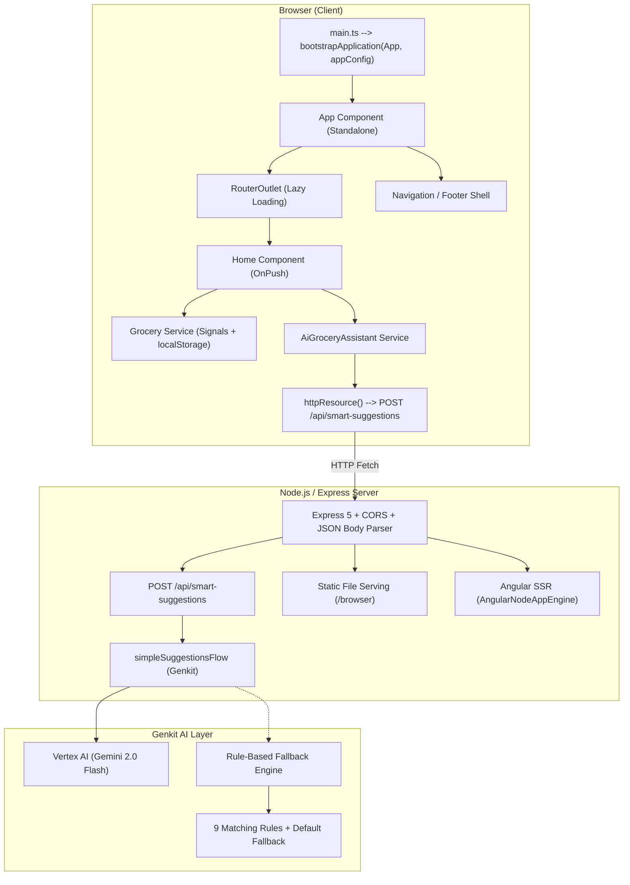
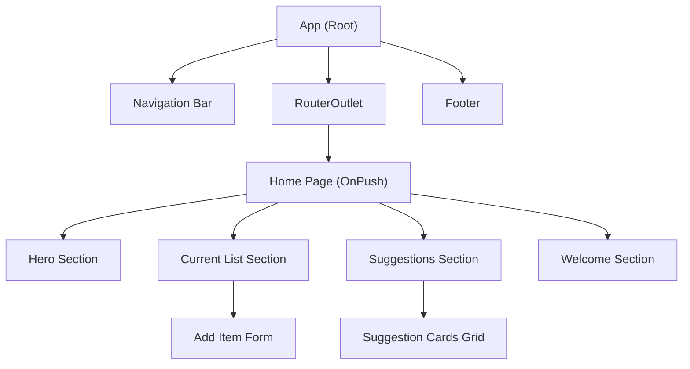
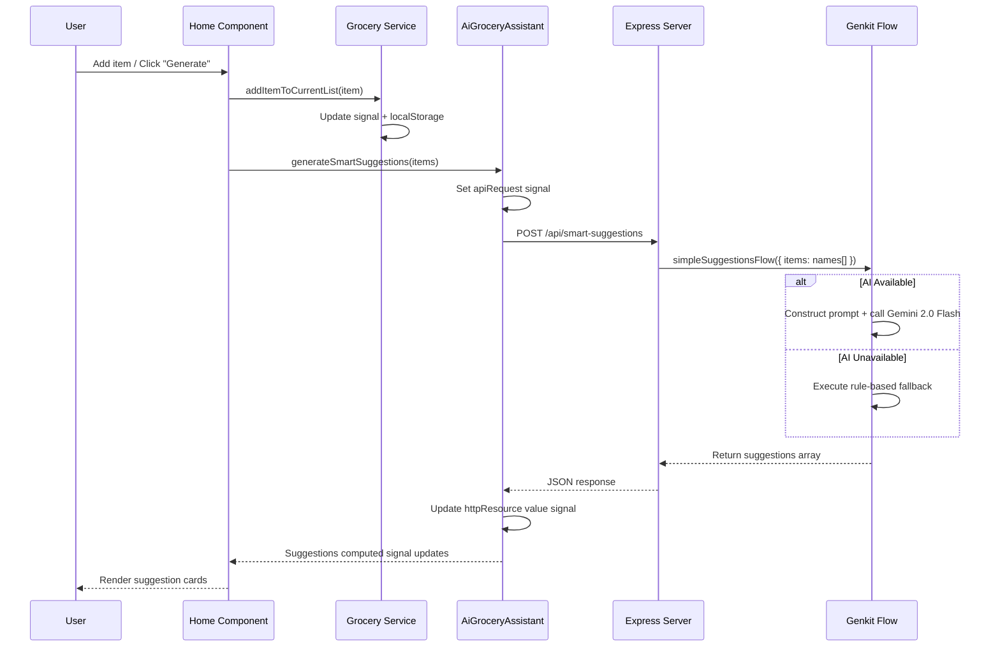
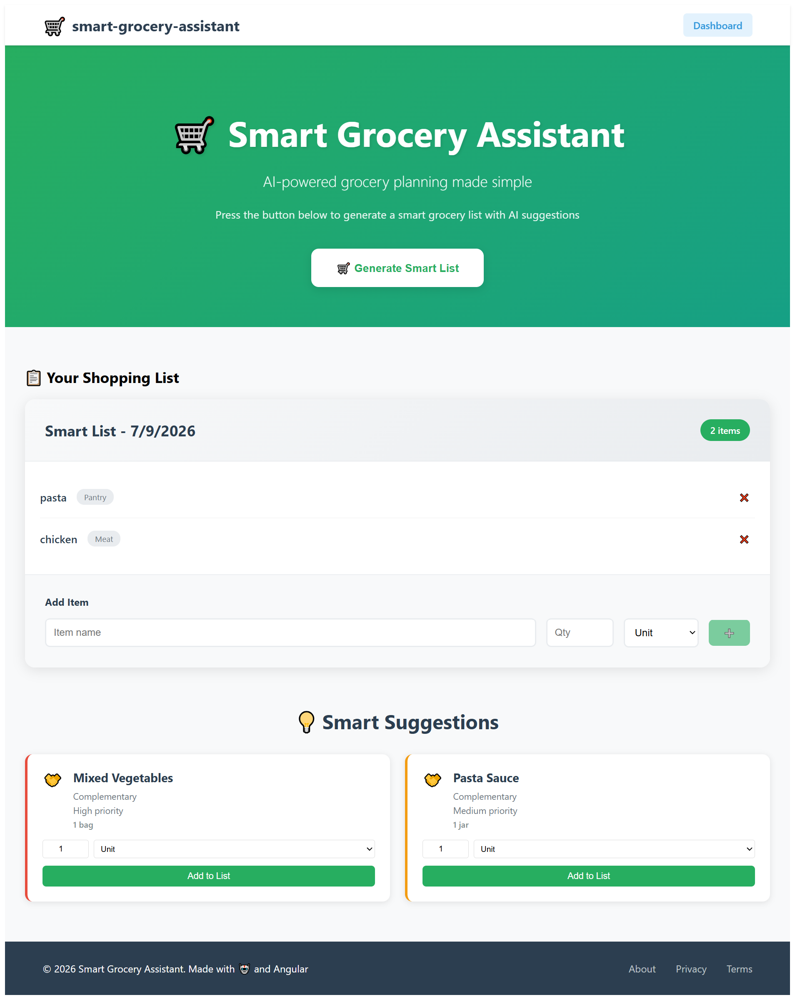
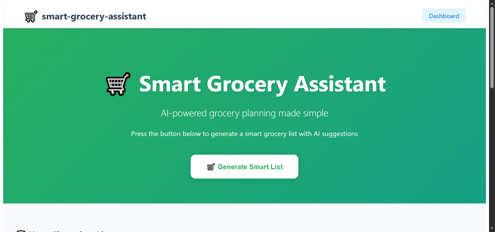
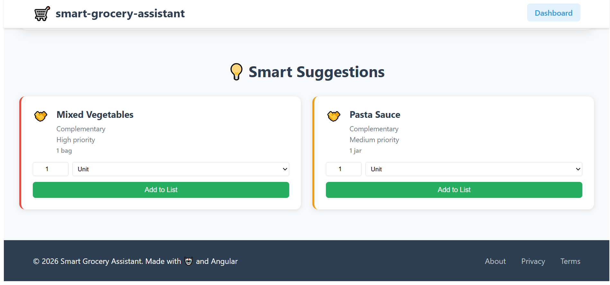
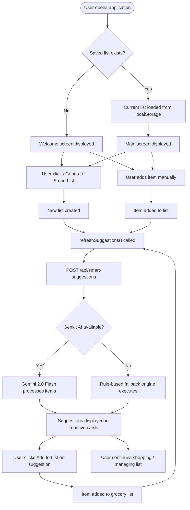

# Smart Grocery Assistant

An intelligent grocery list management application built with Angular 20 and Google Genkit AI. The application provides AI-powered smart suggestions for complementary grocery items, helping users plan their shopping more efficiently through server-side rendering, zoneless change detection, and reactive state management.

---

## Table of Contents

- [Features](#features)
- [Technology Stack](#technology-stack)
- [Architecture](#architecture)
- [Screenshots](#screenshots)
- [Prerequisites](#prerequisites)
- [Setup](#setup)
- [Development Server](#development-server)
- [Build](#build)
- [Production Server](#production-server)
- [Running Tests](#running-tests)
- [Project Structure](#project-structure)
- [API Documentation](#api-documentation)
- [Workflow](#workflow)
- [Angular 20 Features](#angular-20-features)
- [License](#license)
- [Credits](#credits)

---

## Features

- **AI-Powered Suggestions**: Leverages Google Gemini 2.0 Flash through Genkit to suggest complementary grocery items based on your current shopping list. Responses are validated with Zod schemas for type safety.
- **Rule-Based Fallback**: When the AI service is unavailable, an intelligent rule-based system with 9 matching rules provides relevant suggestions. If no rules match, a default set of 5 common staples is returned.
- **Server-Side Rendering**: Built with Angular SSR for improved initial load performance, SEO, and social media preview support.
- **Zoneless Change Detection**: Uses Angular 20's provideZonelessChangeDetection() for optimized rendering without Zone.js overhead.
- **Persistent State**: Grocery lists are automatically saved to localStorage and restored on page reload with SSR-safe guards.
- **Responsive Design**: Fully responsive interface that works seamlessly on desktop and mobile devices with a mobile breakpoint at 768px.
- **Smart Categorization**: Items are automatically categorized into 7 categories: produce, dairy, meat, pantry, beverages, snacks, or other.
- **Unit Suggestions**: Intelligent unit suggestions based on item type keywords (e.g., milk in gallons, meat in pounds, cereal in boxes).

---

## Technology Stack

| Layer              | Technology                                        |
|--------------------|---------------------------------------------------|
| Frontend           | Angular 20, TypeScript 5.8                        |
| SSR                | Angular SSR, Express 5                             |
| AI                 | Google Genkit, Vertex AI (Gemini 2.0 Flash)        |
| Schema Validation  | Zod 3.25                                          |
| HTTP Client        | Angular HttpClient with Fetch API (withFetch())   |
| State Management   | Signals (signal, computed, linkedSignal)           |
| Styling            | Component-scoped CSS with CSS Grid and Flexbox     |
| Testing            | Jasmine 5.7, Karma 6.4                             |
| Build Tool         | Angular CLI 20 (@angular/build:application)        |

---

## Architecture

### System Architecture Diagram



### Component Tree



### Data Flow



---

## Screenshots

| View | Preview |
|------|---------|
| **Welcome Screen** - Initial landing page for new users with quick-start form and getting started tips |  |
| **Shopping List** - Active grocery list with items, quantities, and add-item form |  |
| **AI Suggestions** - Smart suggestion cards with priority indicators and add-to-list controls |  |

---

## Prerequisites

- Node.js 20.19 or later (required for native fetch and ESM support)
- npm 10.x or later
- Angular CLI 20 (`npm install -g @angular/cli`)
- Google Cloud Platform account with Vertex AI enabled (optional - the application functions fully without AI using the rule-based fallback)

---

## Setup

1. Clone the repository:

   ```bash
   git clone https://github.com/ZainulabdeenOfficial/smart-grocery-assistant.git
   cd smart-grocery-assistant
   ```

2. Install dependencies:

   ```bash
   npm install
   ```

3. Configure environment variables:

   ```bash
   cp .env.example .env
   ```

   Edit `.env` with your Google Cloud credentials. This step is optional. The application works without AI configuration using the built-in rule-based fallback engine.

   Required environment variables for AI:

   | Variable                            | Description                        |
   |-------------------------------------|------------------------------------|
   | GOOGLE_GENKIT_ENVIRONMENT           | Set to `dev`                       |
   | GCLOUD_PROJECT                      | Your GCP project ID                |
   | GCLOUD_LOCATION                     | GCP region (e.g. us-central1)      |
   | GOOGLE_APPLICATION_CREDENTIALS      | Path to service account JSON file  |

4. Start the development server:

   ```bash
   ng serve
   ```

5. Open your browser and navigate to `http://localhost:4200`

---

## Development Server

Run `ng serve` for a development server with hot-reload. The application automatically reloads when source files are modified.

```bash
ng serve
```

The Angular dev server runs the full Express application, including custom API routes. No separate backend process is needed during development.

---

## Build

Run `ng build` to build the project for production. The build artifacts are stored in the `dist/` directory.

```bash
ng build
```

The production build includes:
- Optimized client bundle with code splitting
- Server bundle for SSR
- Prerendered routes (configured in app.routes.server.ts)
- Source maps in development mode only

---

## Production Server

After building, start the production server:

```bash
node dist/smart-grocery-assistant/server/server.mjs
```

The server listens on port 4000 by default. Override with the PORT environment variable:

```bash
PORT=8080 node dist/smart-grocery-assistant/server/server.mjs
```

---

## Running Tests

```bash
ng test
```

Tests are configured with Jasmine and Karma. Current test suites:

| Test File                      | Description                     |
|--------------------------------|---------------------------------|
| app.spec.ts                    | Root component creation         |
| home.spec.ts                   | Home component creation         |
| grocery.spec.ts                | Grocery service creation        |
| ai-grocery-assistant.spec.ts   | AI service creation             |

---

## Project Structure

```
src/
  index.html                         Application shell HTML
  main.ts                            Client-side bootstrap entry point
  main.server.ts                     Server-side bootstrap (SSR)
  server.ts                          Express server with SSR and API
  styles.css                         Global styles
  genkit/
    index.ts                         Genkit AI flow configuration and fallback engine
  app/
    app.ts                           Root component
    app.html                         Root template
    app.css                          Root styles
    app.config.ts                    Client-side application config
    app.config.server.ts             Server-side application config
    app.routes.ts                    Route definitions
    app.routes.server.ts             Server-side route configuration
    constants/
      units.ts                       Unit definitions and suggestion logic
    models/
      grocery.type.ts                TypeScript interfaces and enums
    pages/
      home/
        home.ts                      Main grocery list component
        home.html                    Home page template
        home.css                     Home page styles
        home.spec.ts                 Home component tests
    services/
      grocery.ts                     Grocery list service with persistence
      grocery.spec.ts                Grocery service tests
      ai-grocery-assistant.ts        AI suggestion service with httpResource
      ai-grocery-assistant.spec.ts   AI service tests
```

---

## API Documentation

### POST /api/smart-suggestions

Generates AI-powered suggestions for complementary grocery items. Endpoint served by the Express server.

**Request URL:** `POST /api/smart-suggestions`

**Content-Type:** `application/json`

**Request Body:**

```json
{
  "items": [
    {
      "id": "abc123",
      "name": "Milk",
      "category": "dairy",
      "quantity": 1,
      "unit": "gallon",
      "createdAt": "2026-07-09T12:00:00.000Z",
      "updatedAt": "2026-07-09T12:00:00.000Z"
    },
    {
      "id": "def456",
      "name": "Bread",
      "category": "pantry",
      "quantity": 1,
      "unit": "loaf",
      "createdAt": "2026-07-09T12:00:00.000Z",
      "updatedAt": "2026-07-09T12:00:00.000Z"
    }
  ]
}
```

**Success Response (200 OK):**

```json
[
  {
    "item": {
      "id": "xyz789",
      "name": "Bananas",
      "category": "produce",
      "quantity": 1,
      "unit": "bunch",
      "createdAt": "2026-07-09T12:00:01.000Z",
      "updatedAt": "2026-07-09T12:00:01.000Z"
    },
    "reason": "complementary",
    "priority": "medium"
  },
  {
    "item": {
      "id": "xyz790",
      "name": "Strawberry Jam",
      "category": "pantry",
      "quantity": 1,
      "unit": "jar",
      "createdAt": "2026-07-09T12:00:01.000Z",
      "updatedAt": "2026-07-09T12:00:01.000Z"
    },
    "reason": "complementary",
    "priority": "low"
  }
]
```

**Error Response (400 Bad Request):**

```json
{
  "error": "Invalid items array"
}
```

**Error Response (500 Internal Server Error):**

```json
{
  "error": "AI suggestions unavailable",
  "message": "Unable to generate smart suggestions at the moment"
}
```

---

## Workflow

### Application Flow



### Suggestion Decision Flow

```mermaid
flowchart LR
    Input["User adds items to list"]
    Trigger["refreshSuggestions() triggered"]
    HTTP["HTTP POST to /api/smart-suggestions"]
    Server["Express server receives request"]
    Extract["Extract item names from request body"]

    Input --> Trigger
    Trigger --> HTTP
    HTTP --> Server
    Server --> Extract

    subgraph Genkit["Genkit Flow"]
        Validate["Validate input with Zod"]
        Prompt["Build AI prompt with item names"]
        TryAI["Attempt AI.generate() with Gemini"]
        CatchError{"Success?"}
        Rules["Execute rule-based fallback"]
        Return["Return suggestions array"]

        Validate --> Prompt
        Prompt --> TryAI
        TryAI --> CatchError
        CatchError -- "Yes" --> Return
        CatchError -- "No" --> Rules
        Rules --> Return
    end

    Extract --> Validate
    Return --> Response["HTTP 200 JSON response"]
    Response --> Client["Client renders suggestion cards"]
```



---

## Angular 20 Features

This project showcases the following Angular 20 capabilities:

- **Standalone Components**: All components are standalone with no NgModule dependencies. The application bootstraps directly with bootstrapApplication().
- **inject() Function**: Dependency injection performed through the inject() function instead of constructor-based injection.
- **Signals**: Reactive state management using signal(), computed(), and linkedSignal() for all component and service state.
- **httpResource()**: Declarative HTTP resource that automatically manages request lifecycle tied to signal state. Provides isLoading, error, and value signals.
- **Zoneless Change Detection**: Application configured with provideZonelessChangeDetection() for optimized rendering without Zone.js dependency.
- **OnPush Change Detection**: All components use ChangeDetectionStrategy.OnPush for granular change detection.
- **New Control Flow Syntax**: Templates use @if, @for, @else blocks instead of structural directives like *ngIf and *ngFor.
- **SSR with Event Replay**: Server-side rendering configured with provideClientHydration(withEventReplay()) for seamless hydration.
- **Global Error Listeners**: Application configured with provideBrowserGlobalErrorListeners() for centralized error handling.
- **Deferred Loading**: Home component loaded lazily via loadComponent in route configuration.

---

## License

MIT

---

## Credits

**M Zain Ul Abideen** - Full Stack Developer

- GitHub: [ZainulabdeenOfficial](https://github.com/ZainulabdeenOfficial)
- Email: zu4425@gmail.com

---

*Built with Angular 20, Express 5, Google Genkit, and TypeScript 5.8*
